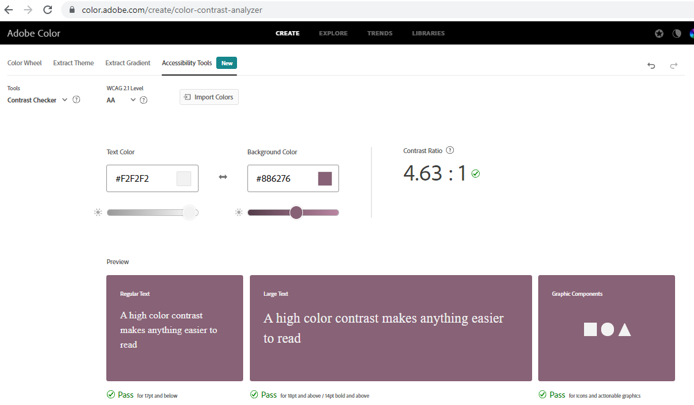
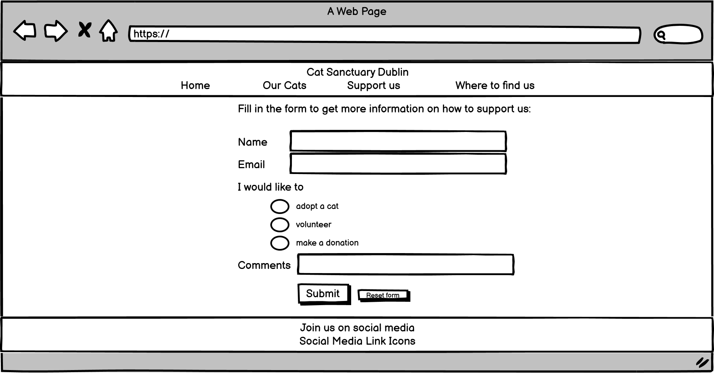

# Cat Sanctuary Dublin

Cat Sanctuary Dublin is a website looking to promote the support for stray cats. It is targeted towards users who are looking to adopt a cat or who would like to support stray cats in Dublin by donating or volunteering. The user can find information about cats that can currently be adopted and can request more information on how to support Cat Sanctuary Dublin by filling out a form. 

## UX

### Colour Scheme 

As a first step a color extractor has been used to extract colors from the choosen background image.

The lighter color #f2f2f2 has been used in a color palette tool to find the main font color #5a374a. 
To make sure it contrasts well against the background image it was tested in a contrast checker both with the lighter and with the darker color extracted from the background image. 

The lighter color #f2f2f2 was used as background color on the other pages and also as font color in the navigation menu and footer.

The third color #886276 was choosen to fit the color scheme. It is used for the supportus button as well as in the navigation hover and form button hover. It was as well checked in a contrast checker against #f2f2f2.

### Typography 

Google fonts has been used to find the two fonts that are displayed on the website. For the headings this is Yaldevi, which is described has a narrow font intended for titles and short texts. For the body the font Roboto is used, which is a common pairing with Yaldevi.

To provide visual cues font-awesome icons have been used in the navigation bar.
- a house icon for the home page
- a cat icon for the ourcats page
- a medical kit icon for the support us page
- a map icon for the wheretofindus page

The links to the social media platforms in the footer are represented with the equivalent icon as well.

### Wireframes

Wireframes created with Balsamiq were used to plan the layout of the website.

## Features 

### Existing Features

- __Navigation Bar__

  - Featured on all 4 pages the navigation bar includes links to the Homepage, Our Cats, Support Us form and Contact page. 
  - It is fully responsive and identical on all pages to offer easy navigation. 
  - It allows the user to easily navigate between the different pages across all devices, without having to use the “back” or “forward” buttons.

- __Home page__

  - The Home page will allow the user to familiarize themselves with the aims and purpose of Cat Sanctuary.
  - The user will see the value of supporting Cat Sanctuary’s cause.

- __Our Cats page__

  - On the Our Cats page the user can get an overview of cats that are currently looking to be adopted.
  - Pictures and details about the cats will show the user an insight into the work of Cat Sanctuary and encourage to contact Cat Sanctuary for more information about adoption.

- __Support Us page__

  - The Support us page will allow the user to request more information from Cat Sanctuary and express their interest in supporting Cat Sanctuary.
  - The user will be asked for their name and email address and they will be able to specify in which way they would like to support. 
  - The user will also be able to leave a custom message for the Cat Sanctuary team.

- __Where to find us page__ 

  - This page provides the user with the address and phone number of Cat Sanctuary. 
  - This will also allow less internet affine users to contact Cat Sanctuary directly in person. This is to ensure the maximum support for Cat Sanctuary from a wider range of users. 

- __The footer__

  - The footer includes links to relevant social media sites for Cat Sanctuary Dublin. The links will open in a new tab. This provides easy navigation. 
  - The footer encourages the user to connect via social media and in this way promote the work of Cat Sanctuary.

### Features Left to Implement

- __Donation page__
    - A page that allows users to make a direct monetary donation online with different payment methods.

- __Blog page__
    - A page where the Cat Sanctuary Team can publish information and photographs about their current work to provide the user with an in depth view.

## Testing 

- The page has been tested and works in different browsers.

- The project is responsive and functions on all standard screen sizes using the devtools device toolbar.

- The navigation, home page, our cats page, support us page, where to find us page and the footer are readable and easy to understand.

- The support us form works and requires a name, email and the selection of one radio button. Comments are optional. The email field requires and email address. The submit and reset buttons are working.

- All colors have been tested with a contrast checker, as can be seen in the color scheme section above. 

  - As the light purple background-color #998f7f that was intially used for the hover of navigation, supportus, submit and resetbutton failed the contrast test, the color #886276 was used instead. This color passes the contrast test with the white color #f2f2f2 that is used as font color in the hover state.

### Validator Testing 

- HTML
  - No errors were returned when passing through the official [W3C validator](https://validator.w3.org/nu/?doc=https%3A%2F%2Fcode-institute-org.github.io%2Flove-running-2.0%2Findex.html)
    - [Home page](https://validator.w3.org/nu/?doc=https://julianegampe.github.io/cat-sanctuary/index.html)
    - [Our cats page](https://validator.w3.org/nu/?doc=https://julianegampe.github.io/cat-sanctuary/ourcats.html)
    - [Support us page](https://validator.w3.org/nu/?doc=https://julianegampe.github.io/cat-sanctuary/supportus.html)
    - [Where to find us page](https://validator.w3.org/nu/?doc=https://julianegampe.github.io/cat-sanctuary/wheretofindus.html)
- CSS
  - No errors were found when passing through the official [(Jigsaw) validator](https://jigsaw.w3.org/css-validator/validator?uri=https%3A%2F%2Fjulianegampe.github[…]&profile=css3svg&usermedium=all&warning=1&vextwarning=&lang=en)
- Accessibility
  - The page passes the accessibility test using lighthouse in devtools

    

### solved Bugs

- The footer was pushed too far down on the home page and on smaller screensizes it was not pushed down enough on the where to find us page.
- This was solved by applying a grid structure to the navigation, main content and footer.
- navigation and footer were set to auto, while the main content was set to 1fr to push the footer down, even if there is not sufficent content
- additionally the size of the background image on the home page was set from 100vh to 100% to allow the footer to appear at the bottom when using a larger screensize

## Deployment

- The site was deployed to GitHub pages. The steps to deploy are as follows: 
  - In the GitHub repository, navigate to the Settings tab 
  - From the source section drop-down menu, select the Master Branch
  - Once the master branch has been selected, the page will be automatically refreshed with a detailed ribbon display to indicate the successful deployment. 

The live link can be found here - https://julianegampe.github.io/cat-sanctuary/

### Local Deployment

If you would like to make a local copy of this repository, you can clone it by typing the following command in your IDE terminal:
- `https://github.com/JulianeGampe/cat-sanctuary.git`

Alternatively, if you use Gitpod, you can [click here](https://gitpod.io/#https://github.com/JulianeGampe/cat-sanctuary) to generate a new workspace using this repository.

## Credits 

### Content 

- The overall project inspiration was taken from [I gatti di Roma – Roman Cats](https://www.gattidiroma.net/web/en/) 
- The icons in the navigation menu and footer were taken from [Font Awesome](https://fontawesome.com/)
  - [Home Icon](https://fontawesome.com/v5.15/icons/home?style=solid)
  - [Our Cats Icon](https://fontawesome.com/v5.15/icons/cat?style=solid)
  - [Support Us Icon](https://fontawesome.com/v5.15/icons/medkit?style=solid)
  - [Where to find us Icon](https://fontawesome.com/v5.15/icons/map-marked-alt?style=solid)
  - [Instagram Icon](https://fontawesome.com/v5.15/icons/instagram-square?style=brands)
  - [Twitter Icon](https://fontawesome.com/v5.15/icons/twitter?style=brands)
  - [YouTube Icon](https://fontawesome.com/v5.15/icons/youtube?style=brands)
- Information for HTML address tag taken from [w3schools](https://www.w3schools.com/tags/tag_address.asp)
- The following websites were used to find the colors and do the contrast tests:
  - [Color Tool](https://material.io/resources/color)
  - [AdobeColor](https://color.adobe.com/create/color-wheel)
  - [Color Scheme Generator](https://coolors.co/)
- The fonts were found on [Google Fonts](https://fonts.google.com/specimen/Yaldevi?query=yaldevi&category=Sans+Serif#about)
- [Balsamiq](https://balsamiq.com/wireframes/desktop/#) was used to create the wireframes

### Media

- The background image used on the Home page was taken from [Pexels](https://www.pexels.com/photo/long-fur-white-cat-1084425/)
- The images for our cats were taken from Pexels
  - ["Athena"](https://www.pexels.com/photo/cute-red-kitten-walking-on-grassy-meadow-in-park-5166200/)
  - ["Charlie"](https://www.pexels.com/photo/a-black-and-white-cat-lying-on-the-carpet-7725964/)
  - ["Lucy and Rosie"](https://www.pexels.com/photo/two-tabby-kittens-lying-down-1787414/)
  - ["Marlene"](https://www.pexels.com/photo/photo-of-grey-tabby-kitten-lying-down-2558605/)
  - ["Milo and Millie"](https://www.pexels.com/photo/black-and-white-tabby-cats-sleeping-on-red-textile-96428/)
